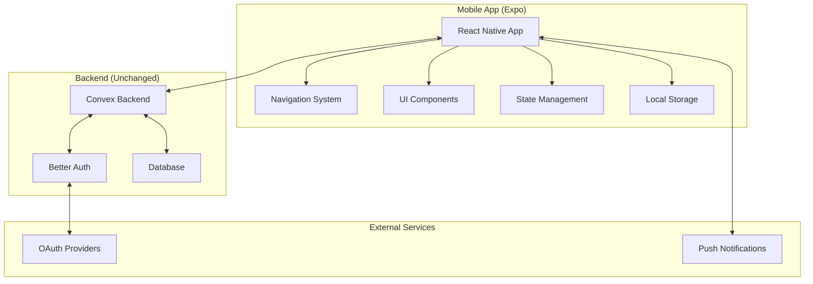

# Design Document: Expo Migration

## Overview

This design document outlines the architecture and implementation approach for migrating the existing TanStack Start workout logger web application to a React Native Expo project. The migration will preserve all existing functionality while adapting the user interface and user experience for mobile platforms.

The migration strategy focuses on maintaining the existing Convex backend infrastructure while rebuilding the frontend using React Native, Expo, and mobile-optimized libraries. This approach ensures data consistency across platforms while providing a native mobile experience.

## Architecture

### High-Level Architecture



### Technology Stack

**Frontend (Mobile)**:
- **React Native**: 0.74+ with Expo SDK 51+
- **Expo Router**: File-based routing system for navigation
- **NativeWind v4**: Tailwind CSS for React Native styling
- **React Navigation v6**: Navigation library for complex navigation patterns
- **Convex React**: Real-time data synchronization
- **AsyncStorage**: Local data persistence
- **Expo SecureStore**: Secure token storage

**Backend (Existing)**:
- **Convex.dev**: Backend-as-a-Service with real-time capabilities
- **Better Auth**: Authentication system with OAuth support
- **TypeScript**: Type safety across the application

**Development Tools**:
- **EAS Build**: Cloud-based build service
- **EAS Update**: Over-the-air updates
- **Expo Dev Tools**: Development and debugging
- **TypeScript**: Static type checking

## Components and Interfaces

### Navigation Architecture

The navigation system will use Expo Router with a nested structure combining tab and stack navigation:

```
app/
├── _layout.tsx              # Root layout with providers
├── (auth)/
│   ├── _layout.tsx          # Auth layout
│   └── login.tsx            # Login screen
└── (tabs)/
    ├── _layout.tsx          # Tab layout
    ├── index.tsx            # Home screen
    ├── workouts/
    │   ├── _layout.tsx      # Workouts stack layout
    │   ├── index.tsx        # Workouts list
    │   └── [id].tsx         # Workout details
    ├── weight/
    │   └── index.tsx        # Weight tracking
    ├── stats/
    │   └── index.tsx        # Statistics
    └── settings/
        ├── index.tsx        # Settings main
        └── profile.tsx      # Profile settings
```

### Component Architecture

**Core Components Structure**:
```
src/
├── components/
│   ├── ui/                  # Base UI components (NativeWind styled)
│   │   ├── Button.tsx
│   │   ├── Input.tsx
│   │   ├── Card.tsx
│   │   └── Modal.tsx
│   ├── app/                 # Application-specific components
│   │   ├── WorkoutCard.tsx
│   │   ├── ExerciseItem.tsx
│   │   ├── SetInput.tsx
│   │   └── StatsChart.tsx
│   └── navigation/          # Navigation components
│       ├── TabBar.tsx
│       └── Header.tsx
├── hooks/                   # Custom React hooks
│   ├── useAuth.ts
│   ├── useWorkouts.ts
│   └── useOfflineSync.ts
├── lib/                     # Utility functions
│   ├── utils.ts
│   ├── storage.ts
│   └── validation.ts
└── types/                   # TypeScript type definitions
    ├── workout.ts
    ├── user.ts
    └── navigation.ts
```

### State Management Strategy

**Convex Integration**:
- Use Convex React hooks for server state management
- Implement optimistic updates for better UX
- Handle real-time synchronization automatically

**Local State Management**:
- React Context for global app state (theme, settings)
- Component-level state for UI interactions
- AsyncStorage for offline data persistence

**Offline Support**:
- Cache critical data locally using AsyncStorage
- Queue mutations when offline
- Sync changes when connectivity is restored

## Data Models

### Core Data Types (Preserved from Web App)

```typescript
// Workout Management
export interface Workout {
  id: string;
  userId: string;
  date: string;
  duration: number;
  startTime?: string;
  endTime?: string;
  isActive?: boolean;
  exercises: Exercise[];
  bodyPartWorkedOut?: string[];
  notes?: string;
}

export interface Exercise {
  id: string;
  name: string;
  sets: WorkoutSet[];
  category?: string;
}

export interface WorkoutSet {
  id: string;
  weight: number;
  reps: number;
}

// Weight Tracking
export interface WeightEntry {
  id: string;
  userId: string;
  date: string;
  weight: number;
  note?: string;
}

// User Profile
export interface Profile {
  id: string;
  userId: string;
  name: string;
  email: string;
  gender?: 'male' | 'female';
  profilePicture?: string;
  fitnessLevel?: 'beginner' | 'intermediary' | 'advanced' | 'pro';
  notificationsEnabled: boolean;
  createdAt: string;
}
```

### Mobile-Specific Extensions

```typescript
// App Settings
export interface AppSettings {
  theme: 'light' | 'dark' | 'system';
  units: 'metric' | 'imperial';
  restTimerDuration: number;
  hapticFeedback: boolean;
  notifications: {
    workoutReminders: boolean;
    restTimerAlerts: boolean;
  };
}

// Offline Sync
export interface OfflineAction {
  id: string;
  type: 'create' | 'update' | 'delete';
  entity: 'workout' | 'exercise' | 'weightEntry';
  data: any;
  timestamp: number;
  synced: boolean;
}
```

### Navigation Types

```typescript
export type RootStackParamList = {
  '(auth)': undefined;
  '(tabs)': undefined;
};

export type TabParamList = {
  index: undefined;
  'workouts/index': undefined;
  'workouts/[id]': { id: string };
  'weight/index': undefined;
  'stats/index': undefined;
  'settings/index': undefined;
  'settings/profile': undefined;
};
```

## Correctness Properties

*A property is a characteristic or behavior that should hold true across all valid executions of a system—essentially, a formal statement about what the system should do. Properties serve as the bridge between human-readable specifications and machine-verifiable correctness guarantees.*

<function_calls>
<invoke name="prework">
<parameter name="featureName">expo-migration

### Property Reflection

After analyzing all acceptance criteria, I've identified several areas where properties can be consolidated to eliminate redundancy:

**Navigation Properties**: Properties 2.3 and 2.4 both test navigation behavior and can be combined into a comprehensive navigation state property.

**Authentication Properties**: Properties 3.2, 3.3, 3.4, and 3.5 all test different aspects of authentication and can be consolidated into fewer, more comprehensive properties.

**Data Synchronization**: Properties 4.2, 4.3, 4.4, and 4.5 all relate to data handling and can be combined.

**UI System Properties**: Properties 5.3, 5.4, and 5.5 test different UI aspects that can be consolidated.

**Workout Management**: Properties 6.2, 6.3, 6.4, and 6.5 test various workout operations that can be combined.

**Performance Properties**: Properties 12.1, 12.2, 12.3, 12.4, and 12.5 all test performance aspects that can be consolidated.

### Correctness Properties

Property 1: TypeScript Compatibility
*For any* TypeScript interface or type from the Web_App, importing and using it in the Expo_App should compile without type errors
**Validates: Requirements 1.3, 1.5**

Property 2: Navigation State Management
*For any* navigation action between screens, the navigation state should be preserved and deep links should resolve to the correct screen
**Validates: Requirements 2.3, 2.4**

Property 3: Authentication Token Security
*For any* successful login attempt, authentication tokens should be stored securely and automatically refreshed when needed
**Validates: Requirements 3.3, 3.4, 3.5**

Property 4: OAuth Provider Support
*For any* supported OAuth provider (Google, Apple), the authentication flow should complete successfully and provide valid user credentials
**Validates: Requirements 3.2**

Property 5: Convex API Compatibility
*For any* Convex query, mutation, or action from the Web_App, executing it in the Expo_App should return the same data structure and maintain real-time synchronization
**Validates: Requirements 4.2, 4.3, 4.5**

Property 6: Offline Data Handling
*For any* data operation performed while offline, the changes should be cached locally and synchronized when connectivity is restored without data loss
**Validates: Requirements 4.4, 10.1, 10.2, 10.3, 10.4**

Property 7: UI Component Adaptation
*For any* Shadcn/ui component from the Web_App, there should be a functionally equivalent React Native component that supports theme switching and platform-specific styling
**Validates: Requirements 5.3, 5.4, 5.5**

Property 8: Workout Data Operations
*For any* workout CRUD operation (create, read, update, delete), the operation should work correctly with proper validation and maintain data consistency
**Validates: Requirements 6.2, 6.4, 6.5**

Property 9: Timer Functionality
*For any* timer operation (start, pause, stop, background), the timer should maintain accurate time tracking and provide appropriate notifications
**Validates: Requirements 6.3, 11.4**

Property 10: Weight Tracking Operations
*For any* weight entry operation (create, edit, delete, visualize), the operation should work correctly and update charts and trends appropriately
**Validates: Requirements 7.2, 7.3, 7.4, 7.5**

Property 11: Statistics Calculation
*For any* workout data set, statistics calculations (frequency, progression, streaks, summaries) should produce accurate results and display correctly in charts
**Validates: Requirements 8.1, 8.2, 8.3, 8.4, 8.5**

Property 12: Profile Management
*For any* profile operation (edit, picture upload, settings change), the operation should work correctly and persist across app sessions
**Validates: Requirements 9.2, 9.3, 9.4, 9.5**

Property 13: Mobile-Specific Features
*For any* mobile-specific interaction (haptic feedback, orientation change, native pickers, sharing), the feature should work correctly across both iOS and Android platforms
**Validates: Requirements 11.1, 11.2, 11.5**

Property 14: Performance Optimization
*For any* large data set or long-running session, the app should maintain responsive performance through lazy loading, efficient rendering, and proper memory management
**Validates: Requirements 12.1, 12.2, 12.3, 12.4, 12.5**

Property 15: Offline Status Indication
*For any* network connectivity change, the app should accurately display the current connection status to users
**Validates: Requirements 10.5**

Property 16: Over-the-Air Updates
*For any* app update delivered via EAS Update, the update should be applied correctly without data loss or functionality regression
**Validates: Requirements 14.2**

## Error Handling

### Network Error Handling

**Connection Failures**:
- Implement exponential backoff for failed requests
- Display user-friendly error messages for network issues
- Provide retry mechanisms for failed operations
- Cache failed mutations for later retry when online

**Offline Mode**:
- Detect network connectivity changes using NetInfo
- Queue mutations when offline and sync when online
- Provide clear offline indicators in the UI
- Handle partial sync scenarios gracefully

### Authentication Error Handling

**Token Expiration**:
- Automatically refresh tokens before expiration
- Handle refresh token failures gracefully
- Redirect to login when authentication fails
- Preserve user's current state during re-authentication

**OAuth Failures**:
- Handle OAuth provider errors (user cancellation, network issues)
- Provide fallback authentication methods
- Clear error states appropriately
- Log authentication errors for debugging

### Data Validation Errors

**Input Validation**:
- Validate all user inputs before submission
- Provide real-time validation feedback
- Handle server-side validation errors
- Maintain form state during error correction

**Data Consistency**:
- Validate data integrity during sync operations
- Handle schema migration errors
- Resolve data conflicts using last-write-wins strategy
- Backup critical data before destructive operations

### Platform-Specific Error Handling

**iOS Specific**:
- Handle App Store review guidelines compliance
- Manage iOS-specific permission requests
- Handle background app refresh limitations
- Manage memory warnings appropriately

**Android Specific**:
- Handle Android back button behavior
- Manage Android-specific permissions
- Handle different screen sizes and densities
- Manage battery optimization settings

## Testing Strategy

### Dual Testing Approach

The testing strategy combines unit tests for specific functionality with property-based tests for comprehensive coverage:

**Unit Tests**:
- Test specific examples and edge cases
- Verify component rendering and user interactions
- Test utility functions and data transformations
- Validate error handling scenarios
- Test platform-specific functionality

**Property-Based Tests**:
- Verify universal properties across all inputs
- Test data consistency and validation rules
- Validate navigation behavior across all routes
- Test authentication flows with various inputs
- Verify offline/online synchronization behavior

### Testing Framework Configuration

**React Native Testing Library**: For component testing and user interaction simulation
**Jest**: For unit tests and mocking
**Detox**: For end-to-end testing on real devices
**Property Testing Library**: fast-check for JavaScript property-based testing

**Property Test Configuration**:
- Minimum 100 iterations per property test
- Each property test references its design document property
- Tag format: **Feature: expo-migration, Property {number}: {property_text}**

### Test Categories

**Component Tests**:
- UI component rendering and styling
- User interaction handling
- Theme switching behavior
- Platform-specific component behavior

**Integration Tests**:
- Navigation flow testing
- Data synchronization testing
- Authentication flow testing
- Offline/online mode switching

**End-to-End Tests**:
- Complete user journeys (workout creation, weight tracking)
- Cross-platform compatibility testing
- Performance testing under load
- Real device testing for platform-specific features

**Property-Based Tests**:
- Data validation and consistency
- Navigation state management
- Authentication token handling
- Offline synchronization behavior
- Performance characteristics

### Performance Testing

**Metrics to Monitor**:
- App startup time (target: <3 seconds)
- Navigation transition time (target: <300ms)
- List rendering performance (target: 60fps)
- Memory usage during long sessions
- Bundle size optimization

**Testing Tools**:
- Flipper for performance profiling
- React DevTools for component analysis
- Expo development tools for bundle analysis
- Platform-specific profiling tools (Xcode Instruments, Android Profiler)